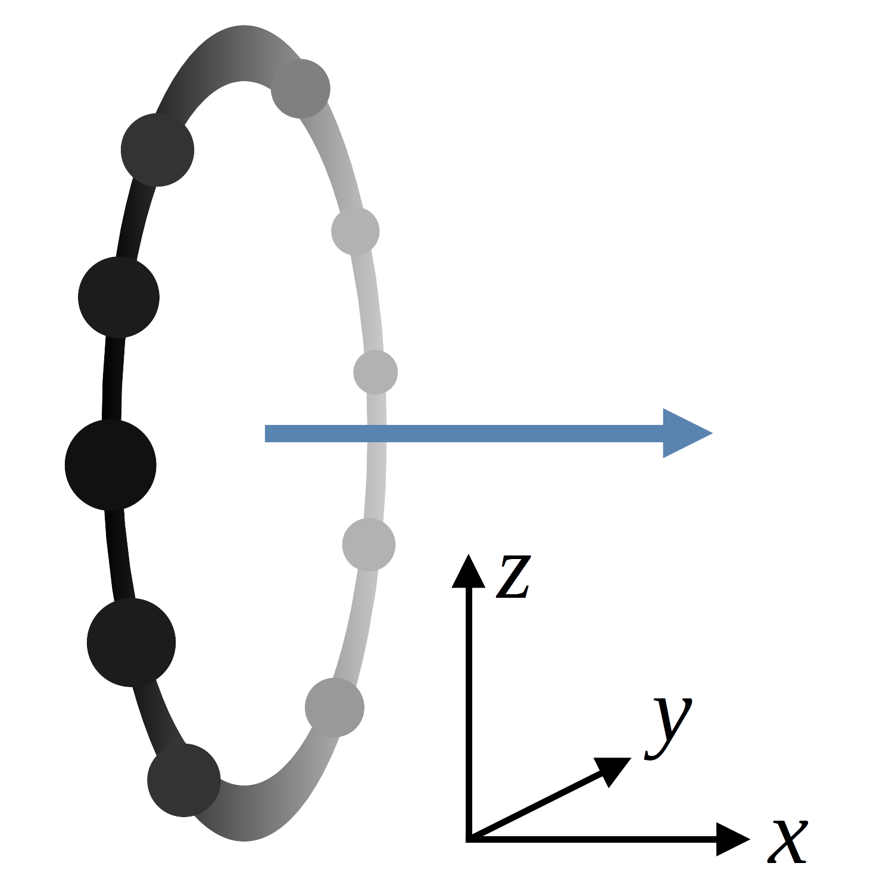
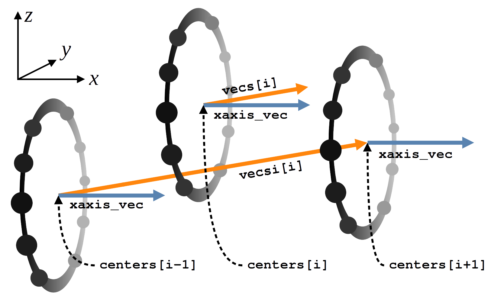
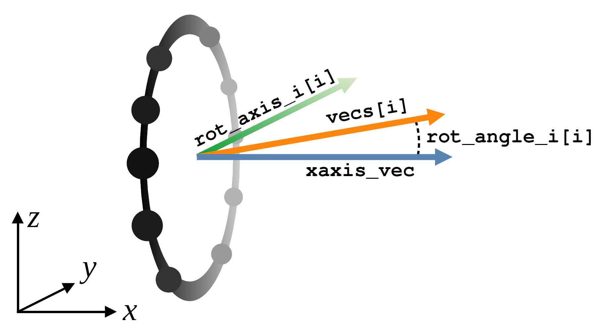
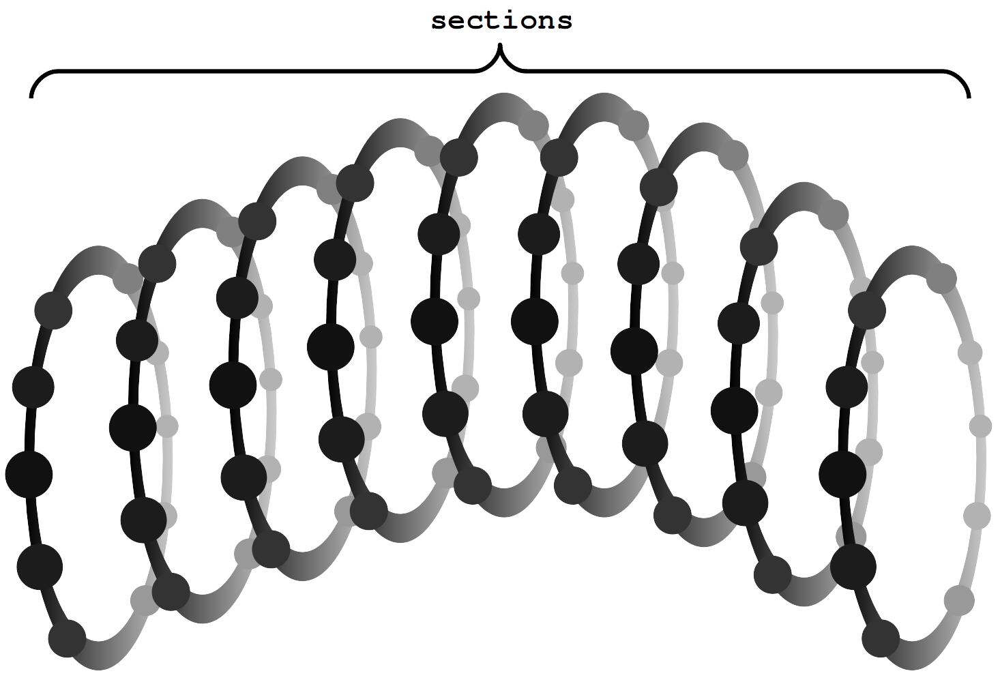
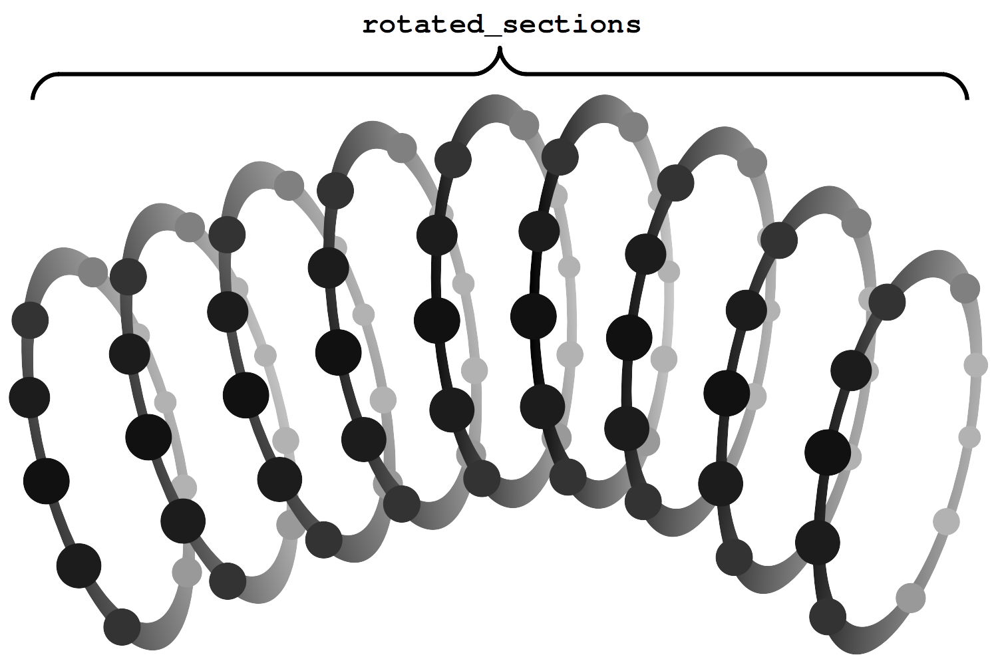
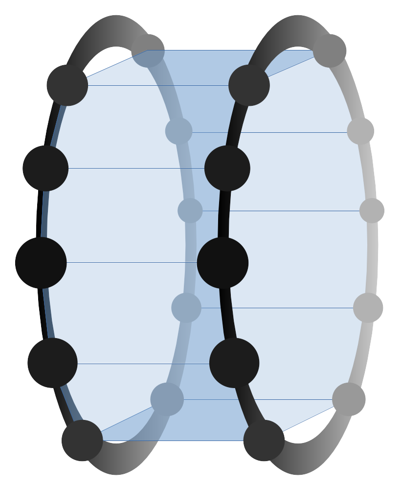

[](https://github.com/artmenlope/matplotlib-streamtubes/blob/master/LICENSE.md)


# matplotlib-streamtubes

## Summary

MATLAB-like streamtubes in Matplotlib.

In this repository you will find a script ([`streamtubes.py`](streamtubes.py)) that can be used as module for plotting streamtubes in Matplotlib.

## Table of contents

- [Examples](#examples)
- [How does it work?](#how-does-it-work)
  - [The `polygonYZ` function](#the-polygonyz-function)
  - [The `calc_angles` function](#the-calc_angles-function)
  - [The `make_sections` function](#the-make_sections-function)
  - [The `plot_streamtube` function](#the-plot_streamtube-function)

## Examples

In this section you will find a couple of examples on how to use [`streamtubes.py`](streamtubes.py) to generate the streamtubes.

The module can be used by placing [`streamtubes.py`](streamtubes.py) in your working directory and importing it using

```python
import streamtubes as st
```

Then, it can be used, for example, running a code line that looks like this:

```python
st.plot_streamtube(ax, x, y, z, r)
```

The following two images are the result of running the scripts [`streamtube_examples_1.py`](streamtube_examples_1.py) and [`streamtube_examples_2.py`](streamtube_examples_2.py) respectively.


 |  
| :-------------: | :-------------: |

## How does it work?

The streamtubes created by the [`streamtubes.py`](streamtubes.py) script are formed by a Matplotlib `Poly3DCollection`. This collection is built using the vertices of properly aligned polygons.

### The `polygonYZ` function

The first step is to build the polygons. Each polygon, centered on a given $(x, y, z)$ point, will consist of a set of points laying on the YZ plane. This arrangement can be seen in **Fig.1**. The blue vector in **Fig.1** corresponds to a unit vector pointing in the x-axis direction and is perpendicular to the surface given by the points.

_**Note**: To differentiate the regular polygons given by the points from the polygons of the `Poly3DCollection`, we will call the regular polygons "sections"._

<p align="center">

<br>
<b>Fig.1</b>: Image of the points of the regular polygon (or section) laying on the YZ plane. 
</p>

In practice, the `polygonYZ` function will take four arguments and one optional argument. The first argument will be the radius of the circle containing the section's points; the other three arguments are the coordinates $x_0$, $y_0$ and $z_0$ of the point where the section is centered. The optional argument is the number of sides of the polygon defining the section and its default value is $n=8$.

### The `calc_angles` function

We will also need to properly align the sections in order to create a smoother streamtube. For this, we will use the [`scipy.spatial.transform.Rotation.from_rotvec`](https://docs.scipy.org/doc/scipy/reference/generated/scipy.spatial.transform.Rotation.from_rotvec.html) function from the Scipy library. This function takes a rotation vector as a parameter. The rotation vector is a vector whose direction is aligned with the rotation axis and whose norm gives the angle of rotation.

Then, our problem is to find the rotation vector of each section. Therefore, we will define the `vecsi` vectors, which will point in the direction in which we want to align the corresponding sections. The `vecsi[i]` vector of the i-th section is defined as the vector joining the centers of the (i-1)-th section and the (i+1)-th section as shown in **Fig.2**. Therefore, we can normalize this resulting vector and define the `vecs[i]` vector of the i-th section as also shown in **Fig.2**.

<p align="center">

<br>
<b>Fig.2</b>: Image showing how is the <i>vecsi[i]</i> vector defined for the i-th section. Remember that the <i>vecs[i]</i> unit vector lays parallel to it.
</p>

In the case of the first an last sections, instead of taking into account the two adjacent sections as shown in **Fig.2**, their `vecsi` vector will be defined only taking into account the considered section and the adjacent section.

With all this, the rotation vector of the i-th section (`rot_axis_i[i]`) will be result of the cross product of the `xaxis_vec` and `vecs[i]` vectors as seen in **Fig.3** (`rot_axis_i[i]` = `xaxis_vec`$\times$`vecs[i]`). Because the two latter vectors are normalized, the rotation vector will also be normalized. 

The rotation angle, `rot_angle_i[i]`, can be obtained through the dot product of the `xaxis_vec` and `vecs[i]` normalized vectors: 

$\cos$(`rot_angle_i[i]`) = `xaxis_vec` **·** `vecs[i]` $\Longrightarrow$ `rot_angle_i[i]` = $\arccos$(`xaxis_vec` **·** `vecs[i]`).

<p align="center">

<br>
<b>Fig.3</b>: Calculation of the rotation vector of the i-th section, <i>rot_axis_i[i]</i>, and its corresponding rotation angle, <i>rot_angle_i[i]</i>.
</p>

Therefore, we can prepare the rotation vectors, `rot_vecs`, for the Scipy's [`scipy.spatial.transform.Rotation.from_rotvec`](https://docs.scipy.org/doc/scipy/reference/generated/scipy.spatial.transform.Rotation.from_rotvec.html) function by multiplying the already obtained rotation vectors with the rotation angles: `rot_vecs[i]` = `rot_angle_i[i]` **·** `rot_axis_i[i]`.

All this is the job done by the `calc_angles` function, which takes as argument only the points where the sections are centered. The `centers` parameter must be an array containing the coordinates $(x_0, y_0, z_0)$ of said points. Therefore, `centers` must be an array of shape $(N, 3)$, where $N$ is the number of sections.

### The `make_sections` function

The `make_sections` function is defined requiring five parameters: `x`, `y`, `z`, `r` and `num_sides`. The latter parameter is optional, its default value is `num_sides = 10` and corresponds to the number of sides of the polygons defining the sections. The `x`, `y` and `z` parameters must be 1D arrays containing, respectively, the $x_0$, $y_0$ and $z_0$ coordinates of the centers of the sections. The `r` array would be the value of the plotted function at each center. The value of the function is represented as the radius of the circle containing the points of the correspondent section.

The `make_sections` function is divided in two parts. In the first part, the function creates the sections from their centers specified in the `centers` argument. An example of the result of the first part of the function can be seen in **Fig.4**.

<p align="center">

<br>
<b>Fig.4</b>: Example of sections generated by the first part of the <i>make_sections</i> function.
</p>

The second part of the `make_sections` function rotates each section properly by using the `calc_angles` function to generate the rotation vectors, using the Scipy's [`scipy.spatial.transform.Rotation.from_rotvec`](https://docs.scipy.org/doc/scipy/reference/generated/scipy.spatial.transform.Rotation.from_rotvec.html) function to generate the Rotation object from the rotation vector and using the `.apply()` method from said object to apply the rotation to the points of the section. 

In order to carry out this last step, each section is moved to the origin of coordinates; then, it is rotated and lastly it is centered back to where it was before. This process results in, for example, something like what is shown in **Fig.5**.

<p align="center">

<br>
<b>Fig.5</b>: Representation of the sections shown in <i>Fig.4</i> after the rotation.
</p>

### The `plot_streamtube` function

The last function in the [`streamtubes.py`](streamtubes.py) script is the `plot_streamtube` function. It is the main function and it is responsible for drawing the streamtube.

The function takes 5 required arguments and 7 optional arguments. The first required argument, `ax`, is the Matplotlib axis where the streamtube is going to be plotted and the other four required arguments are the ones required by the `make_sections` function, that is, `x`, `y`, `z` and `r`. One of the optional parameters is also shared with the `make_sections` function. This optional argument is `num_sides` and its default value is `num_sides = 10`.

The other 6 optional arguments are the following:

| Name | Default value |
| :--- | :------------ |
| `color`| `"black"`|
| `alpha`| `0.2`|
| `linewidths`| `0.5`|
| `cmap_name`| `None`|
| `vmin`| `None`|
| `vmax`| `None`|

The `color`, `alpha` and `linewidths` arguments are for the `Poly3DCollection` of Matplotlib, the `cmap_name` argument is for the `plt.cm.get_cmap` function and the `vmin` and `vmax` arguments are for the `matplotlib.colors.Normalize` function.

The `plot_streamtube` function draws the streamtube as a `Poly3DCollection`. Each polygon from the `Poly3DCollection` lays between two sections and takes four points (two from each section) as vertices. The way the `plot_streamtube` function generates the `Poly3DCollection` is inspired by the `fill_between_3d` function in the [matplotlib-fill_between-in-3D](https://github.com/artmenlope/matplotlib-fill_between-in-3D) repository. A minimal example for understanding how the polygons are arranged is shown in **Fig.6**.

<p align="center">

<br>
<b>Fig.6</b>: Example of a <i>Poly3DCollection</i> generated from two sections.
</p>

---

_**Note:** Figures made with LibreOffice Impress._

